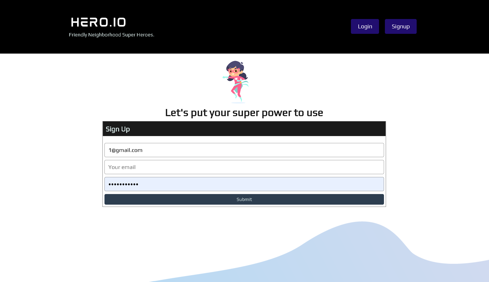

# Hero.IO
Collaboration project 

# What does it do?
Hero.IO allows people to help people by creating a feed where people can apply to others' volunteer requests

<!-- technologies used -->
# Programming Languages and APIs Used
GraphQl, CSS, React.js, Node.js, MongoDb, Axios

<!-- screenshot -->
# How it Looks

# How to Deploy UnsubHub

https://dev8057.d2bcqfip8p0c5j.amplifyapp.com/

### What was your motivation?
We wanted to make an app that would make it easier to for individuals in community to reach out get help from thir amazing neighbors and fellow citizens 

### Why did you build this project? (Note: the answer is not "Because it was a homework assignment.")
Aside from our motivatio, we wanted to try to make a full stack app with React.js and GraphQl. 

### What did you learn?
The smallest errors can brake everything. The use of 2 servers made it easier to make a mistake. Collaboration was huge for us for in avoiding issues and ensuring we completed a working product. 

## Contributing
- Paulo Sergio Condori Pinedo
- Nashbi Grand-Jean
- J.Henry Rowland
- Benton Washington

#Questions 
If you have any questions about the repo, open an issue or contact me directly at paulocondori1@gmail.com. You can find more of my work at pcondori1996

